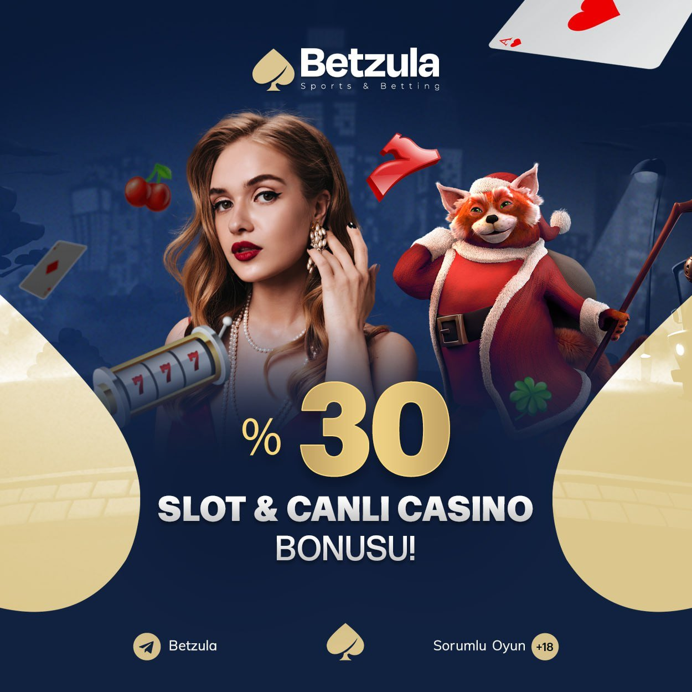

Betzula265 | Betzula 265 | Betzula Giriş Adresi
===================================

   
Betzula bahis firmasının en sağlam giriş bağlantısı **betzula265.com** şeklinde yazılmıştır. Bu ülkede canlı rulet websitelerine direk ulaşım sağlama problemi karşı karşıya kalan bahis severler şuanki değişen son giriş adresi isteğine kapılmışlardır. Yanımızdakilerle bize düşen sorumluluğu uygulamak hedefiyle daima yasadışı canlı rulet ofislerini filtreleyerek siz sevgili takipçilere yardımcı olacağız. Kovuşturulan Ofansifbet347, Ultrabet890, Şutbet589 ve Betasus762 başlıklarıdır.

`SİTEYE ERİŞİM İÇİN TIKLAYIN! <https://uclck.me/gonow>`_
==============

.. list-table:: **SON ADRES DEĞİŞİKLİKLERİ**
   :widths: 100
   :header-rows: 1

   * - FİRMA
   * - `Betlike555 | Betlike 555 <betlike555-betlike-555-betlike-giris-adresi.html>`_
   * - `Betpark757 | Betpark 757 <betpark757-betpark-757-betpark-giris-adresi.html>`_
   * - `Bayşanslı518 | Bayşanslı 518 <baysansli518-baysansli-518-baysansli-giris-adresi.html>`_	 
   * - `Betnis449 | Betnis 449 <betnis449-betnis-449-betnis-giris-adresi.html>`_	 
   * - `Roketbet142 | Roketbet 142 <roketbet142-roketbet-142-roketbet-giris-adresi.html>`_ 
   * - `Napolyonbet404 | Napolyonbet 404 <napolyonbet404-napolyonbet-404-napolyonbet-giris-adresi.html>`_
   * - `Atlantisbahis504 | Atlantisbahis 504 <atlantisbahis504-atlantisbahis-504-atlantisbahis-giris-adresi.html>`_	 
   * - `321Gorabet | 321 Gorabet <321gorabet-321-gorabet-gorabet-giris-adresi.html>`_
   * - `Ngsbahis712 | Ngsbahis 712 <ngsbahis712-ngsbahis-712-ngsbahis-giris-adresi.html>`_
   * - `Forvetbet643 | Forvetbet 643 <forvetbet643-forvetbet-643-forvetbet-giris-adresi.html>`_
	 
Betzula265 İstatistikleri:
===================================	 
* Adres değişikliği inceleme sayısı: 104
* Google'dan gelen ziyaretçi sayısı: 491
* Yandex'den gelen ziyaretçi sayısı: 579
* Younow'dan gelen ziyaretçi sayısı: 1945
* Duckduckgo'dan gelen ziyaretçi sayısı: 1174
* Slot Oyunu Oynayanlar: 1626
* Canlı Bahis Yapanlar: 494
* Firmayı Beğenenlerin Yüzdelik Sayısı(%): %41
* Ortalama Kazanma Şansınız Yüzdelik Olarak(%): %60
* Günlük Ortalama Ziyaretçi Sayısı: 41
