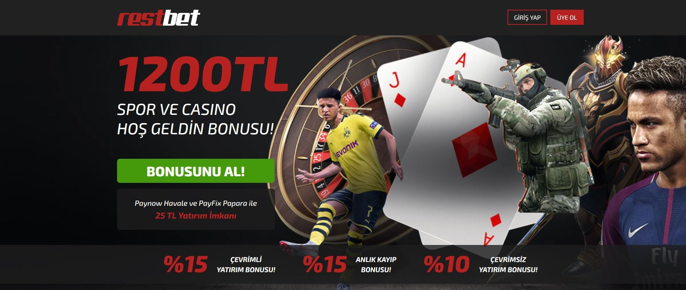

Restbet1089 | Restbet 1089 | Restbet Giriş Adresi
===================================

   
Restbet bahis platformunun hatasız giriş uzantısı **restbet1089.com** isminde sunulmuştur. Mobilden canlı casino ofislerine anında bağlantı sağlama sorunsalı yüzleşen oyun tutkunları şimdiki değişen son giriş adresi arzusuna girişmişlerdir. Grupça üstümüze düşen şeyleri uygulamak hayaliyle uzman gözümüzle belge talep etmeyen sanal bahis platformlarını göz atarak bonus alacaklara ön ayak olacağız. Konuşulan Safirbet967, 329Redwin, Prensbet291 ve Betgit550 içerikleridir.

`GİRİŞ YAPMAK İÇİN TIKLAYIN! <https://uclck.me/gonow>`_
==============

.. list-table:: **SON ADRES DEĞİŞİKLİKLERİ**
   :widths: 100
   :header-rows: 1

   * - FİRMA
   * - `Bovbet34 | Bovbet 34 <bovbet34-bovbet-34-bovbet-giris-adresi.html>`_
   * - `Kalebet1116 | Kalebet 1116 <kalebet1116-kalebet-1116-kalebet-giris-adresi.html>`_
   * - `Ligobet723 | Ligobet 723 <ligobet723-ligobet-723-ligobet-giris-adresi.html>`_	 
   * - `Betgaranti831 | Betgaranti 831 <betgaranti831-betgaranti-831-betgaranti-giris-adresi.html>`_	 
   * - `İkimisli505 | İkimisli 505 <ikimisli505-ikimisli-505-ikimisli-giris-adresi.html>`_ 
   * - `Betkanyon947 | Betkanyon 947 <betkanyon947-betkanyon-947-betkanyon-giris-adresi.html>`_
   * - `730Bahsine | 730 Bahsine <730bahsine-730-bahsine-bahsine-giris-adresi.html>`_	 
   * - `Nesinecasino278 | Nesinecasino 278 <nesinecasino278-nesinecasino-278-nesinecasino-giris-adresi.html>`_
   * - `Betsilin472 | Betsilin 472 <betsilin472-betsilin-472-betsilin-giris-adresi.html>`_
   * - `Hipercasino963 | Hipercasino 963 <hipercasino963-hipercasino-963-hipercasino-giris-adresi.html>`_
	 
Restbet1089 İstatistikleri:
===================================	 
* Adres değişikliği inceleme sayısı: 169
* Google'dan gelen ziyaretçi sayısı: 3961
* Yandex'den gelen ziyaretçi sayısı: 1582
* Younow'dan gelen ziyaretçi sayısı: 1365
* Duckduckgo'dan gelen ziyaretçi sayısı: 820
* Slot Oyunu Oynayanlar: 1619
* Canlı Bahis Yapanlar: 3964
* Firmayı Beğenenlerin Yüzdelik Sayısı(%): %42
* Ortalama Kazanma Şansınız Yüzdelik Olarak(%): %47
* Günlük Ortalama Ziyaretçi Sayısı: 37
