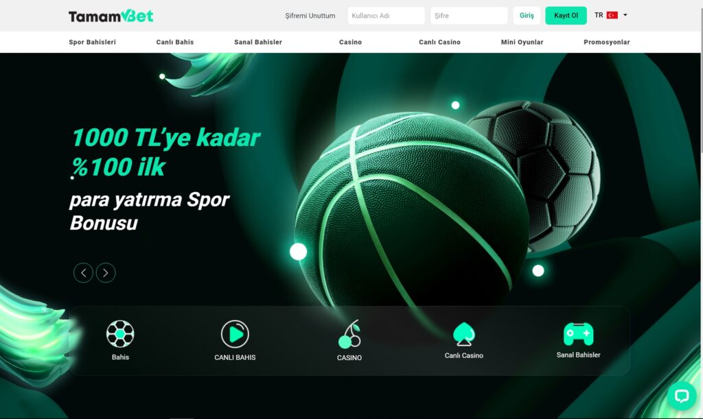

Tamambet209 | Tamambet 209 | Tamambet Giriş Adresi
===================================

   
Tamambet bahis platformunun erişim meselesi olmayan giriş noktası **tamambet209.com** isminde sunulmuştur. Ülkemizde canlı kumar ofislerine erişim hatası ile karşılaşan sanal bahis tutkunları o anki kentisiz ulaşım adresi arzusuna koyulmuşlardır. Takım olarak üstümüze düşen şeyleri uygulamak amacıyla objektif olarak Türkiye'nin önde gelen  blackjack platformlarını belirterek siz sevgili oyunculara yardım edeceğiz. Bakılan 493Timebet, Wipbet561, Kavbet460 ve Restbet1088 sorgulamalarıdır.

`GİRİŞ İÇİN TIKLAYIN! <https://uclck.me/gonow>`_
==============

.. list-table:: **SON ADRES DEĞİŞİKLİKLERİ**
   :widths: 100
   :header-rows: 1

   * - FİRMA
   * - `Betgaranti833 | Betgaranti 833 <betgaranti833-betgaranti-833-betgaranti-giris-adresi.html>`_
   * - `Sembolbet310 | Sembolbet 310 <sembolbet310-sembolbet-310-sembolbet-giris-adresi.html>`_
   * - `Bovbet33 | Bovbet 33 <bovbet33-bovbet-33-bovbet-giris-adresi.html>`_	 
   * - `Rexusbet396 | Rexusbet 396 <rexusbet396-rexusbet-396-rexusbet-giris-adresi.html>`_	 
   * - `Teslabahis344 | Teslabahis 344 <teslabahis344-teslabahis-344-teslabahis-giris-adresi.html>`_ 
   * - `Teslabahis347 | Teslabahis 347 <teslabahis347-teslabahis-347-teslabahis-giris-adresi.html>`_
   * - `Baymavi836 | Baymavi 836 <baymavi836-baymavi-836-baymavi-giris-adresi.html>`_	 
   * - `Rüyabet346 | Rüyabet 346 <ruyabet346-ruyabet-346-ruyabet-giris-adresi.html>`_
   * - `Routebet460 | Routebet 460 <routebet460-routebet-460-routebet-giris-adresi.html>`_
   * - `Avrupabet445 | Avrupabet 445 <avrupabet445-avrupabet-445-avrupabet-giris-adresi.html>`_
	 
Tamambet209 İstatistikleri:
===================================	 
* Adres değişikliği inceleme sayısı: 477
* Google'dan gelen ziyaretçi sayısı: 871
* Yandex'den gelen ziyaretçi sayısı: 715
* Younow'dan gelen ziyaretçi sayısı: 721
* Duckduckgo'dan gelen ziyaretçi sayısı: 678
* Slot Oyunu Oynayanlar: 1650
* Canlı Bahis Yapanlar: 874
* Firmayı Beğenenlerin Yüzdelik Sayısı(%): %2
* Ortalama Kazanma Şansınız Yüzdelik Olarak(%): %95
* Günlük Ortalama Ziyaretçi Sayısı: 144
