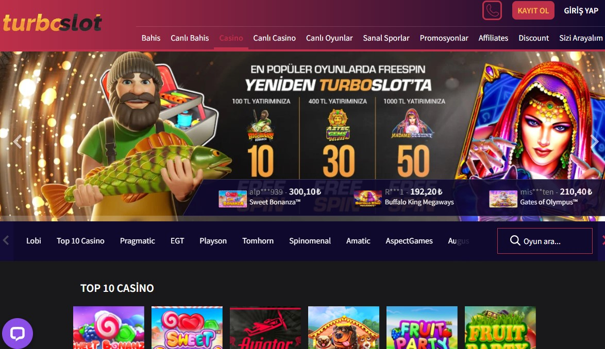

Turboslot388 | Turboslot 388 | Turboslot Giriş Adresi
===================================

   
Turboslot sitesinin engelsiz giriş domaini **turboslot388.com** isminde değişikliğe uğramıştır. Yaşadığımız şehirde casino ofislerine direk ulaşım problemi yüzleşen sanal bahis tutkunları bu anki bağlantı adresi arzusuna kapılmışlardır. Yanımızdakilerle üstümüze düşen görevi uygulamak maksadıyla daima illegal slot şirketlerini araştırarak üyelik hesabı oluşturacaklara ön ayak olacağız. Soruşturulan 495Timebet, Betovis501, Smartbahis312 ve Megabahis677 başlıklarıdır.

`DEVAM ETMEK İÇİN TIKLAYIN! <https://uclck.me/gonow>`_
==============

.. list-table:: **SON ADRES DEĞİŞİKLİKLERİ**
   :widths: 100
   :header-rows: 1

   * - FİRMA
   * - `493Türkbet | 493 Türkbet <493turkbet-493-turkbet-turkbet-giris-adresi.html>`_
   * - `Genzobet128 | Genzobet 128 <genzobet128-genzobet-128-genzobet-giris-adresi.html>`_
   * - `Padişahbet608 | Padişahbet 608 <padisahbet608-padisahbet-608-padisahbet-giris-adresi.html>`_	 
   * - `Freybet506 | Freybet 506 <freybet506-freybet-506-freybet-giris-adresi.html>`_	 
   * - `Casinomega441 | Casinomega 441 <casinomega441-casinomega-441-casinomega-giris-adresi.html>`_ 
   * - `Virajbet262 | Virajbet 262 <virajbet262-virajbet-262-virajbet-giris-adresi.html>`_
   * - `Sahabet1113 | Sahabet 1113 <sahabet1113-sahabet-1113-sahabet-giris-adresi.html>`_	 
   * - `Taksimbet241 | Taksimbet 241 <taksimbet241-taksimbet-241-taksimbet-giris-adresi.html>`_
   * - `Aspercasino518 | Aspercasino 518 <aspercasino518-aspercasino-518-aspercasino-giris-adresi.html>`_
   * - `Coinbar300 | Coinbar 300 <coinbar300-coinbar-300-coinbar-giris-adresi.html>`_
	 
Turboslot388 İstatistikleri:
===================================	 
* Adres değişikliği inceleme sayısı: 107
* Google'dan gelen ziyaretçi sayısı: 4581
* Yandex'den gelen ziyaretçi sayısı: 942
* Younow'dan gelen ziyaretçi sayısı: 945
* Duckduckgo'dan gelen ziyaretçi sayısı: 910
* Slot Oyunu Oynayanlar: 1760
* Canlı Bahis Yapanlar: 4584
* Firmayı Beğenenlerin Yüzdelik Sayısı(%): %71
* Ortalama Kazanma Şansınız Yüzdelik Olarak(%): %54
* Günlük Ortalama Ziyaretçi Sayısı: 68
